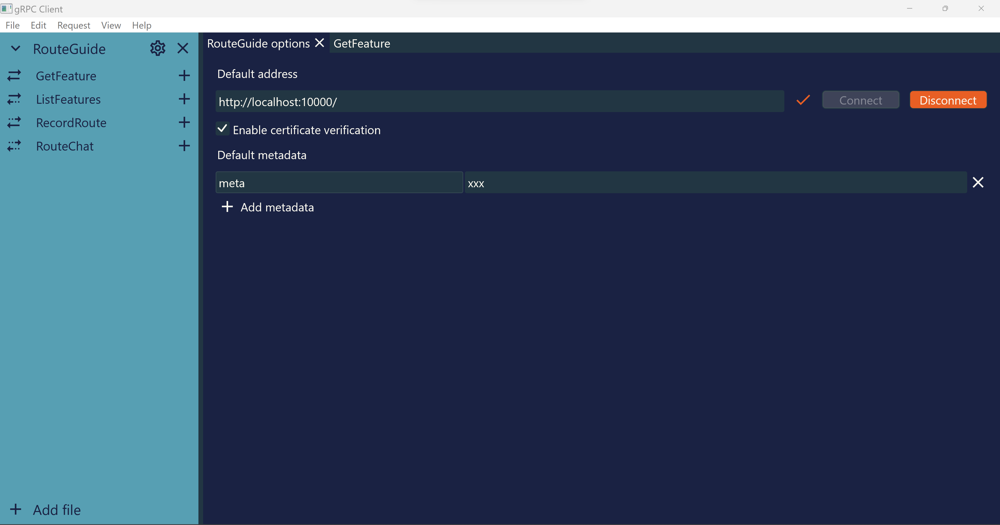
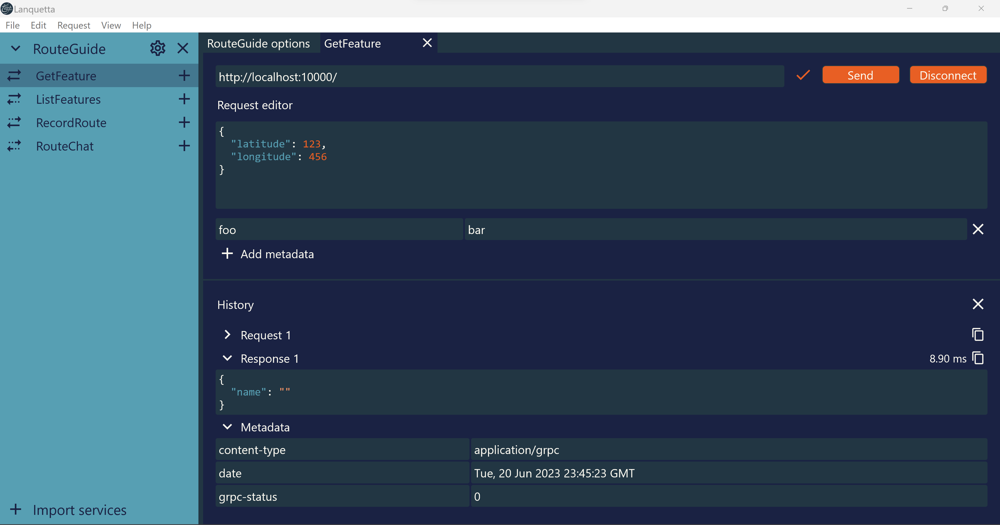

# Lanquetta

A GUI application for testing gRPC services.

## Getting started

To get started, click "Add file" in the sidebar and select your `.proto` file. The file will be automatically compiled and all the services added to the sidebar.

If you have a more complex protobuf file structure (for example, you need to specify additional include paths), you can instead import a file descriptor set. To generate one, run `protoc` with the `--descriptor_set_out` argument:

```sh
protoc file.proto -I . -I /extra/include --include_imports --descriptor_set_out filedescriptorset.bin
```

## Options

The  button for a service opens a tab which controls default configuration for a service.



## Calling your service

The  button for a service method opens a tab where you can call your gRPC service. The history of previous requests and responses is displayed in the bottom pane.

