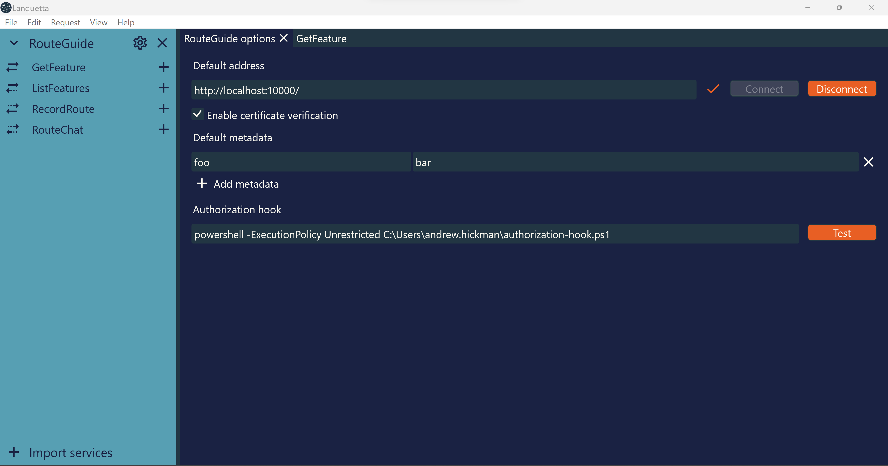

# Lanquetta

A GUI application for testing gRPC services.

## Getting started

To get started, click "Add file" in the sidebar and select your `.proto` file. The file will be automatically compiled and all the services added to the sidebar.

The include paths used to load proto files can be configured under "File > Import services > Compiler Options". It is also possible to load a file descriptor set generated by running `protoc` with the `--descriptor_set_out` argument.

## Options

The  button for a service opens a tab which controls default configuration for a service.

## Calling your service

The  button for a service method opens a tab where you can call your gRPC service. The history of previous requests and responses is displayed in the bottom pane.

